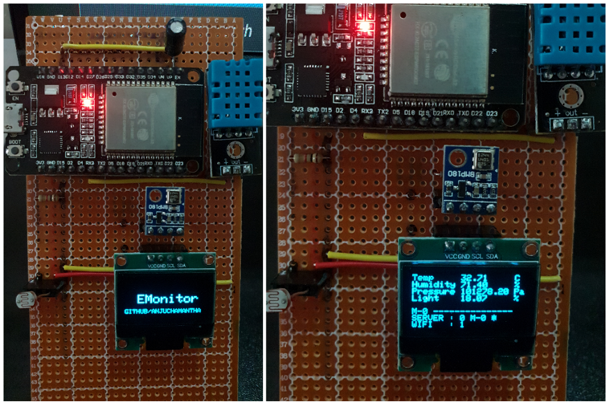
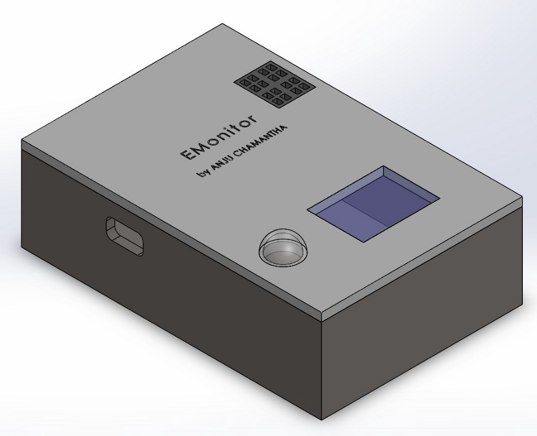
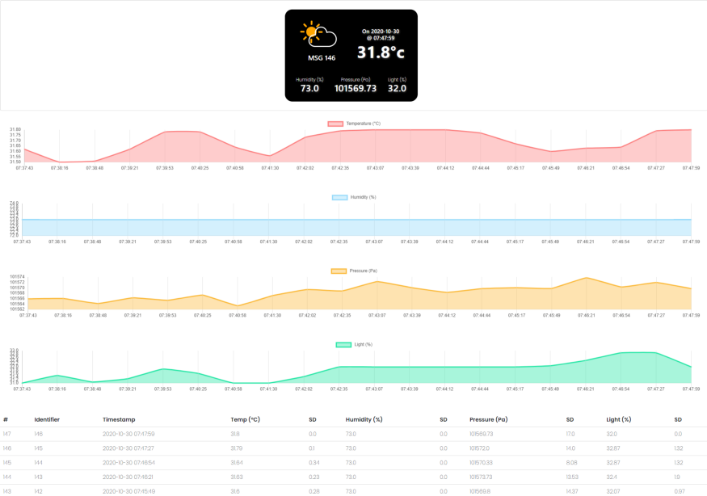
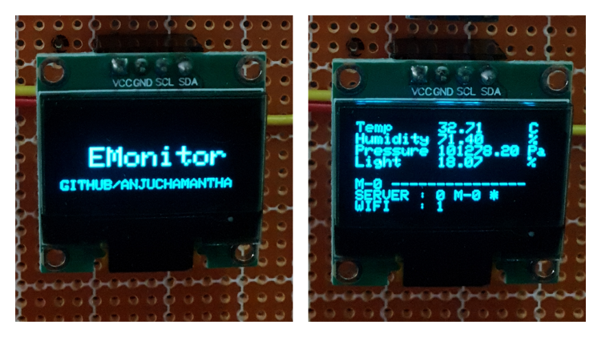
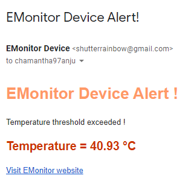
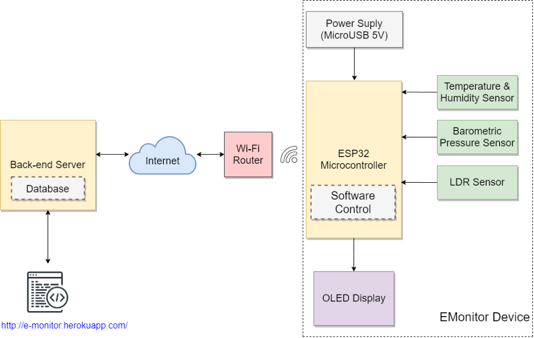
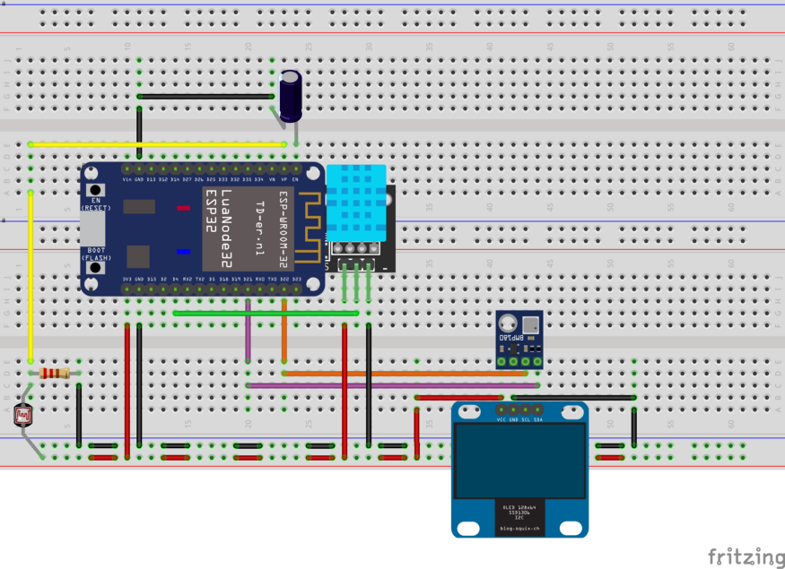
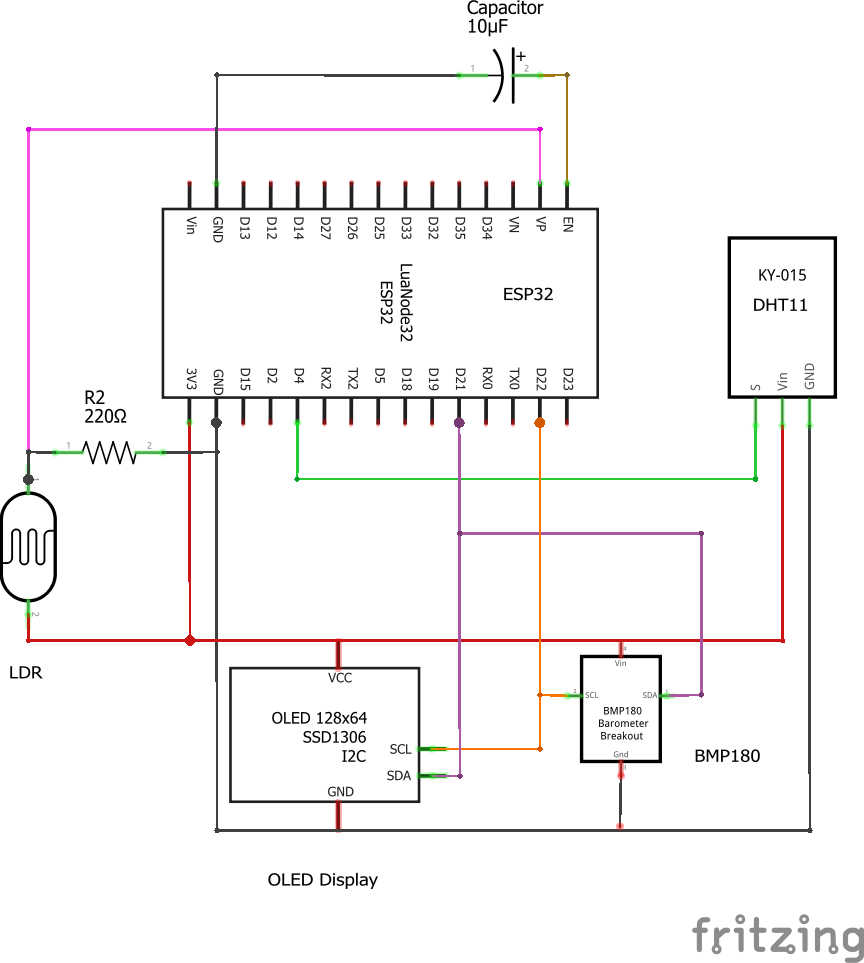
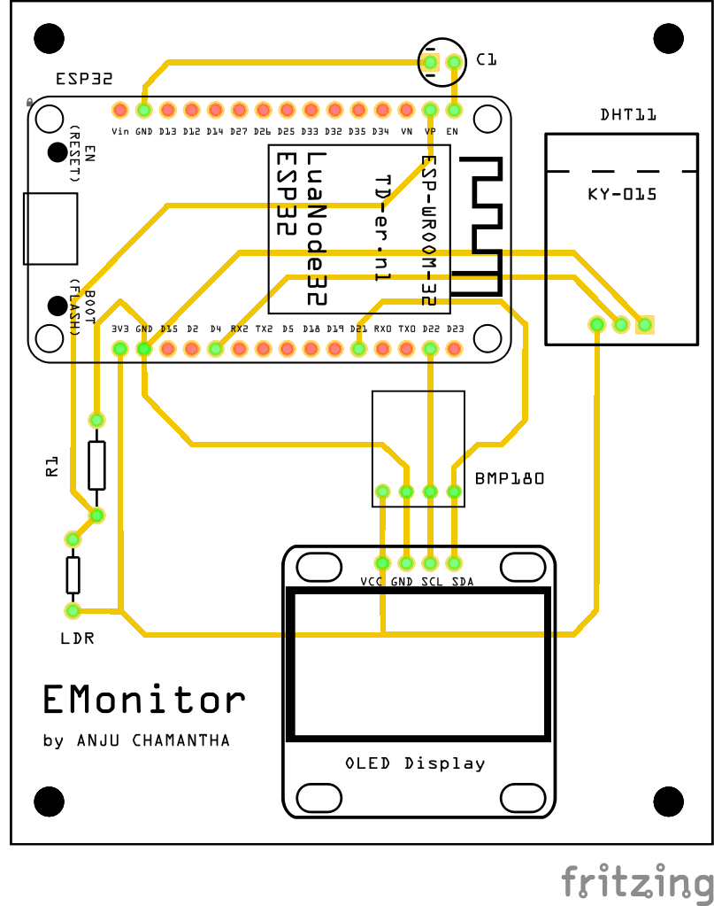

> Website : http://e-monitor.herokuapp.com
>
> GitHub  : https://github.com/anjuchamantha/EMonitor
>
> YouTube : https://youtu.be/ITUB2IDSrXQ


#### 1) Introduction

EMonitor is an ESP32 Microcontroller based device which gets environmental data such as Temperature, Humidity, Pressure, Light Intensity, and sends those data to a Back-end database server using CAP(Common Alert Protocol). Also, those data and other connection status information can be viewed from the OLED-display locally. The data that was sent to the server can be visualized using a simple [web-page](http://e-monitor.herokuapp.com/). The device also features self fault recovery mechanisms to add more reliability to the system. EMonitor also sends a warning e-mail to pre-defined e-mail addresses in case of any sensor data exceeds a given threshold value.

#### 2) EMonitor Device: features & specifications

_Prototype Device_





>Scope of the Project

EMonitor is an [ESP32](https://www.espressif.com/en/products/socs/esp32) microcontroller-based device which has Wi-Fi inbuilt. With its Xtensa LX6 microprocessor operating at 240 MHz and memory of 520 KiB SRAM, EMonitor is more than capable of capturing the environment and sending data to the server after doing the necessary calculations seamlessly. It runs on [FreeRTOS](https://www.iottechtrends.com/best-operating-systems-arduino/), a leading operating system supported by Arduino which can be working with the relevant peripherals smoothly.

##### 2.1) Measuring Parameters

* Temperature (°C) — DHT11 Sensor module

* Humidity (%) — DHT11 Sensor module

* Pressure (Pa) — BMP180 Sensor module

* Light Level (%) — LDR module

##### 2.2) Power

The device can be powered using a Micro USB cable which is a very reliable mode of powering the ESP32 microcontroller. Since almost every standard mobile phone charging adapter outputs 5V, this device can be powered using the same way which means there’s nothing to worry about power. Also, EMonitor can be powered using any mobile phone charging power-bank which makes the device portable.

The ESP32 is a low power consuming microcontroller relative to other microcontrollers in the market and has adaptive power controlling mechanisms which can handle some basic power-related matters that make the EMonitor very reliable when powering with a Micro USB cable.

##### 2.3) Communication Protocol

Data is transmitted from the EMonitor device to the cloud-hosted [EMonitor server](http://e-monitor.herokuapp.com/) using [CAP](http://docs.oasis-open.org/emergency/cap/v1.2/CAP-v1.2-os.html) (Common Alerting Protocol) over the internet. CAP is an XML-based data format for exchanging public warnings and emergencies between alerting technologies.

##### 2.4) Sensor Readings & Data sending to server

The sensor data (temperature, humidity, pressure, light level) are read at T time intervals and after N number of sensor readings, the Mean & Standard Deviation of those N number of data are sent to the server using CAP protocol. So the data is sent to the server at TN time intervals. (There can be an average 2–3s delay other than TN due to the other logics and calculations)

**Example:** Take N=15 & T=60s => The sensor readings are taken every 1 minute and after 15 rounds/readings (after 1min x 15 = 15 minutes) the mean and standard deviation of those 15 samples are sent to the server.

Following are the basic data sent to the server as a message which is referred to as `MSG` hereafter.

`msg_id, timestamp, temperature, humidity, pressure, light, temperature_sd, humidity_sd, pressure_sd, light_sd`

Other than these data, some constant data that are mandatory for CAP, like `sender`, `msg type`, `category`, `urgency` etc are also sent to the server.

##### 2.5) Self-Recovery in a Connection Loss

The EMonitor device is capable of withstanding the following scenarios in which the connection is lost.

- Wi-Fi connection Lost

- Loss of connection to the EMonitor server

The device can self re-connect to Wi-Fi or self re-connect to the server in any of the above cases. But the data is secure even during such connection issues.

In both the above cases, EMonitor detects the connection issue and cash the raw data which were not sent to the server due to connection loss, to a buffer. After each TN time interval, the device checks the connection and if the connection is stable, it sends all the data which were buffered, to the server and clears the buffer. (During this process also if the connection is lost, it keeps the data safe in the buffer without removing)

#### 3) Website, Server & Database : Features & Specifications

**Deployed EMonitor website: http://e-monitor.herokuapp.com/**



The backend server is developed using [Flask](https://flask.palletsprojects.com/en/1.1.x/) which is a Python-based web framework. It supports all the existing python libraries and tools and hence it is very much scalable and extensible.

The database used is [PostgreSQL](https://www.postgresql.org/) and all the data that comes to the server from the EMonitor device are saved in a database table of values, `msg_id, timestamp, temperature, humidity, pressure, light, temperature_sd, humidity_sd, pressure_sd, light_sd`

The backend supports the following end-points to communicate with it.

- [POST] : /data

- [GET] : /

The EMonitor device uses `/data` end-point to send data to the server using CAP protocol.

`/` endpoint is used to access the main dashboard of the EMonitor website, which shows the current(last received) readings as well as charts and the data of the last 20 readings received.

#### 4) Special Features

##### 4.1) OLED Display to view Readings and the Connection States



OLED Display shows the temperature, humidity, pressure, and light level values which are sent to the server with the `msg_id` after each TN time interval. Also, it shows the Wi-Fi and Server connection statuses.(0 - Not connected, 1 - Connected)

It also shows if a `MSG` is not sent to the server and buffered (using a `*` symbol) and sends buffered `MSG`s to the server 

##### 4.2) Automatic warning Email sending through EMonitor Device



The EMonitor device sends a WARNING e-mail to a pre-defined e-mail address if the value of a `MSG` exceeds a given threshold limit.

Currently, if the temperature mean exceeds 40°C it sends a warning e-mail to my personal email.

#### 5) Design Architecture Diagram



#### 6) Schematic diagram of EMonitor Device

_Breadboard Circuit Schematic_



_Schematic Diagram_



_PCB Design_



#### 7) Fault Recovery Implementation

As mentioned in 2.5) Self-Recovery in a Connection Loss, EMonitor is capable of self connecting to Wi-Fi & Server after a connection retrieval. During the period of connection loss, the MSGs are buffered and when the connection is established back, it sends the buffered MSGs to the server.

##### 7.1) Auto connect to Wi-Fi
##
```cpp
	void loop{
    		//calculate readings and create CAP MSG
    		if (WiFi.status() != WL_CONNECTED)
    		{
        		//if not connected, try to connect to WiFi in each loop iteration
        		bool connected = connect_to_wifi();
        		if (connected){
            			//send MSG to server
        		}
        		else{
            			//buffer MSG
        		}
   	 	}
    		else{
        		//send MSG to server
    		}
	}
​
	bool connect_to_wifi(){
    		WiFi.begin(SSID,PW) //begin the wifi connection
    		if (WiFi.status() == WL_CONNECTED)
    		{
        		return truue;
    		}
    		else{
        		return false;
    		}
	}
```

##### 7.2) MSG Buffering

There are a total of 11 buffers as follows

```cpp
	queue<String> buffer_identifier;
	queue<String> buffer_datetime;
	queue<int> buffer_msg_ids;
​
	//mean buffers
	queue<double> buffer_t;
	queue<double> buffer_h;
	queue<double> buffer_p;
	queue<double> buffer_l;
​
	//sd buffers
	queue<double> buffer_t_;
	queue<double> buffer_h_;
	queue<double> buffer_p_;
	queue<double> buffer_l_;

	void loop{
  	   //BUFFER LOGIC
​
  	   //loop buffer if buffer is not empty
  	   //    if connected
  	   //        POST buffer data and pop from buffer
  	   //    else break
    		while (!buffer_msg_ids.empty()){
        		if (WiFi.status() == WL_CONNECTED){
            	  	   //create CAP MSG from raw data in buffers
            			if (sendPostRequest(xmlchar_buf, msg_id_buf)){
                			popBuffers();
            			}
        		}
		}
    
   		//MAIN LOGIC
    
    		//calculate readings and create CAP MSG
    		if (WiFi.status() != WL_CONNECTED)
    		{
        		bool connected = connect_to_wifi();
        		if (connected){
            			//send MSG to server
            			if (!sendPostRequest(xmlchar, msg)){
                			//buffer MSG
                			pushToBuffers();
            			}
        		}
        		else{
            			//buffer MSG
            			pushToBuffers();
        		}
    		}
    		else{
        		//send MSG to server
        		if (!sendPostRequest(xmlchar, msg)){
            			//buffer MSG
            			pushToBuffers();
        		}
    		}
	}
​
	void pushToBuffers(){
    		//push all the raw data needed for MSG to queues
	}
​
	void popBuffers(){
    		//pop the front element from the queues
	}
```

##### 7.3) Self start after a power retrieval

When after a power failure and when the power is retrieved back, the device is automatically started and continued the data reading and data transmitting process as usual.

#### 8) List of components and their costs

- NodeMCU ESP-32S Microcontroller (LKR 1,050.00)

- BMP180 Digital Barometric Pressure Sensor (LKR 185.00)

- DHT11 Temperature & Relative Humidity Sensor (LKR 250.00)

- LDR (LKR 10)

- OLED Display 0.96" (LKR 600.00)

- Resistor 220Ohm (LKR 1.00)

- Capacitor 10 micro F (LKR 20) — Used to back out the code uploading issue of ESP32

- Vero Board & Circuit Wires (LKR 150)

#### 9) Algorithm used for the device and server (Pseudo code)

##### 9.1) EMonitor Device Algorithm

_main.cpp_

```cpp
	void beginOLED(){
    		//initial setup and starting of OLED Display
	}
	void displayText(){
    		//display the content in the OLED display
    		//in various places, this function is called to print sensor and other information
	}
	void getTimeStamp(){
    		//get the current time
	}
	void popBuffers(){
    		//pop the front element from the queues
	}
	void pushToBuffers(){
    	//push all the raw data needed for MSG to queues
	}
​
	void setup(){
    		beginOLED();
    		wait_and_connect_to_wifi();
    		begin_sensors();
    		configTime();
	}
​
	void loop(){
    
  		//BUFFER LOGIC
​
  		//loop buffer if buffer is not empty
  		//    if connected
  		//        POST buffer data and pop from buffer
  		//    else break
    		while (!buffer_msg_ids.empty()){
        		if (WiFi.status() == WL_CONNECTED){
            			//generate CAP XML message from the data in buffers
            			generateXMLStr();
            			if (sendPostRequest(xmlchar_buf, msg_id_buf)){
                			popBuffers();
            			}
       			 }
   		 }
    
    		//MAIN LOGIC
    
    		//calculate readings and create CAP MSG
    		int x = 0;
    		int rounds = 15;
    		int round_time = 2000;
    		while (x < rounds){
        		readTemperature();
        		readHumidity();
        		readPressure();
        		readLightIntensity();
            
        		delay(round_time);
        		x++;
    		}
    		temperature = calculate_mean(t_, rounds);
    		humidity = calculate_mean(h_, rounds);
    		pressure = calculate_mean(p_, rounds);
    		light = calculate_mean(l_, rounds);
    
    		temperature_sd = calculate_sd(t_, rounds, temperature);
    		humidity_sd = calculate_sd(h_, rounds, humidity);
    		pressure_sd = calculate_sd(p_, rounds, pressure);
    		light_sd = calculate_sd(l_, rounds, light);
    
    		getTimeStamp(datetime_);
    
    		//send WARNING e-mail
    		if ((temperature > 40) && (WiFi.status() == WL_CONNECTED)){
        		//if a warning e-mail has not sent in last 5minutes
        		//  send mail
    		}
    
    		//generate CAP XML message from the calculated data
    		generateXMLStr();
    
    		if (WiFi.status() != WL_CONNECTED)
   		{
        		bool connected = connect_to_wifi();
        		if (connected){
            			//send MSG to server
            			if (!sendPostRequest(xmlchar, msg)){
                			//buffer MSG
                			pushToBuffers();
            			}
       			}
        		else{
            			//buffer MSG
            			pushToBuffers();
        		}
    		}
    		else{
        		//send MSG to server
        		if (!sendPostRequest(xmlchar, msg)){
            			//buffer MSG
            			pushToBuffers();
        		}
    		}
	}
```
##
##### 9.2) Backend Server Logic
##

```cpp
	#database table model
	class EMonitor(db.Model):
    		__tablename__ = 'sensor_data'
    		id = db.Column(db.Integer, primary_key=True)
    		msg_id = db.Column(db.String(128))
    		timestamp = db.Column(db.String(128))
​
    		temperature = db.Column(db.Float)
    		humidity = db.Column(db.Float)
    		pressure = db.Column(db.Float)
    		light = db.Column(db.Float)
​
    		temperature_sd = db.Column(db.Float)
    		humidity_sd = db.Column(db.Float)
    		pressure_sd = db.Column(db.Float)
    		light_sd = db.Column(db.Float)
    
    
	def extract_data_from_xml(xml_str):
    		"""
    		Given a XML string(CAP) this extracts the 'parameter' values
    		:param xml_str: XML as a string
    		:return: data as dictionary {name:value}
    		"""
  
	def put_to_db(xml_data):
    		"""
    		given a data dictionary this method put the data to the database
    		:param xml_data: data as dictionary {name:value}
    		:return: True if database write successful, otherwise False
    		"""
    
	@app.route('/data', methods=['POST'])
	def post():
    		xml_str = request.data
    		xml_data = extract_data_from_xml(xml_str)
    		print("[POST] /data : ", xml_data)
    		if put_to_db(xml_data):
        		return "DATABASE updated"
    		else:
        		return "DATABASE modification failed !"
 
	@app.route('/')
	def index():
    		#query the database table and get the list of data
    		table = EMonitor.query.order_by(desc(EMonitor.timestamp)).limit(20).all()
​
    		return render_template("index.html", table)
```

#### 10) Annexure — Full source code

The full source code(Both EMonitor device & Server) can be viewed in https://github.com/anjuchamantha/EMonitor
