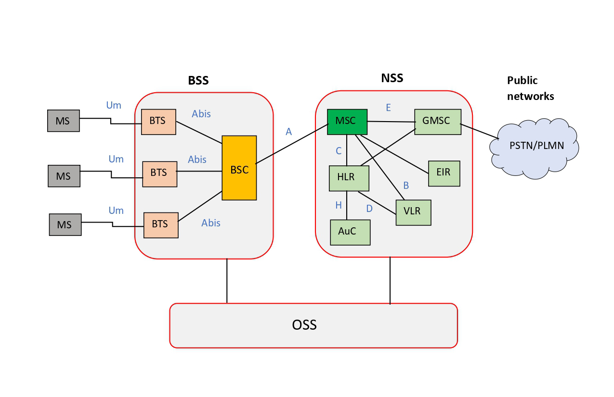

[GSM](https://www.tutorialspoint.com/gsm/gsm_architecture.htm) is a digital cellular technology that is used for transmitting mobile voice and data services.
GSM architecture is mainly divided into four parts.
1. Mobile Station (MS)
2. Base Station Subsystem (BSS)
3. Network Switching Subsystem (NSS)
4. Operation and Support Subsystem (OSS)

#### Interfaces
* Um – Air interface between MS and BTS
* Abis – BSS internal interface that connects BTS and BSC
* A – Interface between BSC and MSC
* B – Interface between MSC and VLR
* C – Interface between MSC and HLR/ Interface between GMSC and HLR
* D – Interface between HLR and VLR
* E – Interface between two MSCs/ Interface between MSC and GMSC
* F – Interface between MSC and EIR

---

#### 1.Mobile Station (MS)

Mobile station is the user’s handset and it has two parts.

**Mobile Equipment** – This contains radio transceiver, display, and digital signal processors.

**Subscriber Identity Module (SIM)** – This allows subscribers to use their mobile devices to access subscribed services such as    receiving calls and sending SMS.

#### 2.Base Station Subsystem (BSS)

BSS controls the traffic handling and signaling between MS and NSS. This has two parts.

**Base Transceiver Station (BTS)** – This is a fixed radio transceiver that connects MS to the network. This sends and receives radio signals to the mobile devices, convert them to digital signals and transmit them to BSC. This has some following functions,

-Encoding, encrypting, multiplexing, modulating, and feeding the RF signals to the antenna.
-Transcoding and rate adaptation.
-Time and frequency synchronizing.
-Decoding, decrypting, and equalizing received signals.

**Base Station Controller (BSC)** – BSC controls and monitors the radio resources for one or more base stations. Also, it provides a connection between mobile devices and MSC. Followings are some functions of BSC.

-Handling radio channel setup, frequency hopping and handovers.
-Assigns and releases frequencies and time slots for the MS.
-Controls the power transmission of the BSS and MS in its area.
-Allocates necessary time slots between BTS and MSC.

#### 3.Network Switching Subsystem (NSS)

NSS provides the main control and interfacing for the whole mobile network. It has following main components.

**Mobile Services Switching Centre (MSC)** – This is the main part of NSS. Main function of MSC is switching of call between mobile and other mobile or fixed network users. Also, it provides services such as authentication, registration, call location, inter-MSC handovers and call routing to a roaming subscriber.

**Gateway Mobile Switching Centre (GMSC)** – This is used to route calls outside the network. That is when a subscriber wants to call someone outside the network or the subscriber receiving a call from outside the network, that call routed through the GMSC.

**Home Location Register (HLR)** – This is a database which stores permanent data of subscribers such as location, service profile and activity status. When a person buys a SIM, all information about this subscription is stored in HLR.

**Visitor Location Register (VLR)** – This is a database which stores temporary data of subscribers and always integrated with MSC. When MS roams into a new MSC area it connected with that MSC and request data about the MS from HLR. Then, when MS wants to make a call it has relevant data for that process.

**Authentication Centre (AuC)** – AuC is a protected database which includes a copy of the secret key that contained in subscriber’s SIM card. Authentication and ciphering of the radio channel are the functions of AuC.

**Equipment Identity Register (EIR)** – This is a database which contains a list of all valid mobile equipment on the network. Each mobile station has a number called International Mobile Equipment Identity (IMEI). According to the information in the EIR, the MS is allocated one of three states that are allowed onto the network, barred access or monitored in case its problems.

#### 4.Operation and Support Subsystem (OSS)

This part is connected to both BSS and NSS. Main function of OSS is control and monitor the overall GSM network. Also, it is used to control the traffic load of the BSS. Administration and commercial management, security management and network configuration are some functions of OSS.

### Further Information

[GSM Network Architecture - electronicsnote](https://www.electronics-notes.com/articles/connectivity/2g-gsm/network-architecture.php#:~:text=The%20GSM%20network%20architecture%20consists,%2C%20HLR%2C%20VLR%2C%20etc.)

[GSM Architecture - tutorialspoint](https://www.tutorialspoint.com/gsm/gsm_architecture.htm)

[GSM - Wikipedia](https://en.wikipedia.org/wiki/GSM)

[GSM architecture Training Course - TELECOMA Global](https://www.youtube.com/watch?v=1POzl9tZXuQ)

